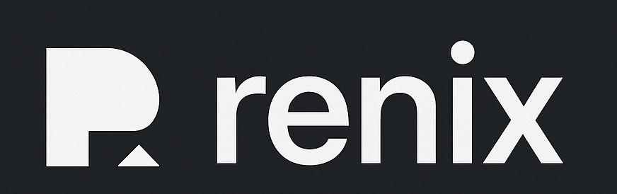

# Renix



Renix is a reproducible security tooling workspace built on Nix. It pins every dependency, so you get the same set of reconnaissance tools, debuggers, and language toolchains on any machine.

## Features
- Unified environment for popular recon tools such as nmap, sqlmap, ffuf, amass, and Metasploit
- Language toolchains for Rust, Go, C/C++, Java, Scala, Ruby, Zig, and Python with useful extras preinstalled
- Flake-enabled setup for repeatable builds and simple extension with custom modules
- Modular structure: each toolchain lives in its own `src/**.nix` file for easy tweaking or removal

## Tooling Matrix
| Tool | Category | Status |
| --- | --- | --- |
| Nmap | Reconnaissance | ✅ Ready |
| SQLmap | Reconnaissance | ✅ Ready |
| FFuf | Reconnaissance | ✅ Ready |
| Amass | Reconnaissance | ✅ Ready |
| Metasploit | Exploitation | ✅ Ready |
| Mimikatz | Credential Access | ✅ Ready |
| GDB | Debugging | ✅ Ready |
| LLDB | Debugging | ✅ Ready |
| Rust Toolchain | Language | ✅ Ready |
| Go Toolchain | Language | ✅ Ready |
| C/C++ Toolchain | Language | ✅ Ready |
| Java Toolchain | Language | ✅ Ready |
| Scala Toolchain | Language | ✅ Ready |
| Ruby Toolchain | Language | ✅ Ready |
| Zig Toolchain | Language | ✅ Ready |
| Python Toolchain | Language | ✅ Ready |
| Your Tool Here | TBD | 🔜 Planned |

## Quick Start
```bash
# Clone the repository
git clone https://github.com/ironfisto/renix.git
cd renix

# Enter the development shell (preferred)
nix develop
# or fall back to the legacy interface
nix-shell
```

Or use the Makefile shortcuts from the project root:

```bash
make start   # open nix-shell using main/shell.nix
make up      # alias for make start
make setup   # install Nix in single-user mode (run once per machine)
make build   # enter the flake-enabled nix develop shell
```

## Usage
Once inside the shell you can launch any included tool immediately. A few example commands:
```bash
nmap -sV target.com
sqlmap -u "http://target.com/page.php?id=1"
ffuf -w wordlist.txt -u http://target.com/FUZZ
msfconsole
```
Use the language toolchains as you normally would, e.g. `cargo build`, `go test`, `python -m venv .venv`, and so on.

## Customize
- Add new tools by creating a module (for example `src/recon/mytool.nix`) and importing it from `main/shell.nix`
- Update existing tool versions by editing the relevant Nix expressions
- Pin additional inputs by extending `main/flake.nix`

## Project Layout
```
main/
  flake.nix      # Flake entry point
  shell.nix      # Aggregate development shell
src/
  langs/         # Language toolchains
  recon/         # Reconnaissance and exploitation tools
assets/          # Images and other collateral
```

## Requirements
- Nix 2.4 or later with flakes enabled (`experimental-features = nix-command flakes`)

## Support
Issues and pull requests are welcome on the GitHub repository. Contributions that improve documentation, add tooling, or streamline the developer experience are appreciated.
